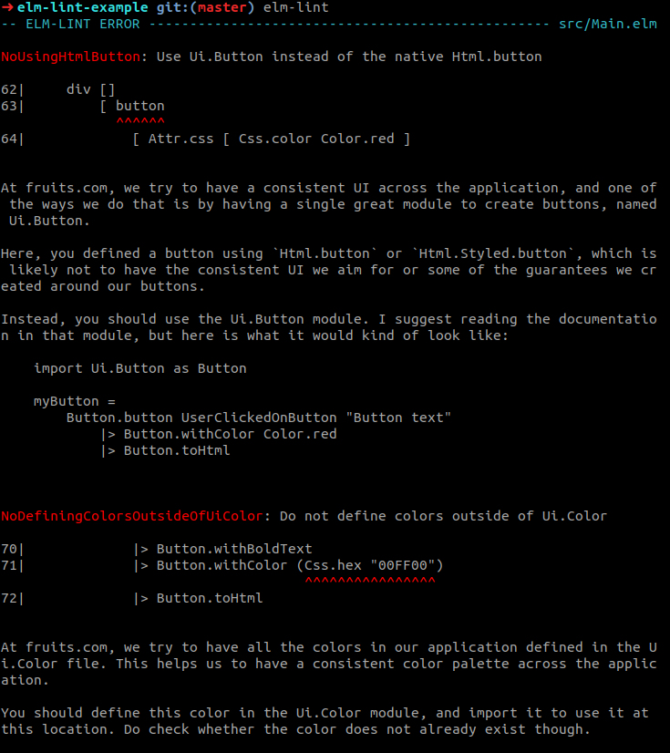

I am happy to announce the release of [`elm-lint`](https://package.elm-lang.org/packages/jfmengels/elm-lint/latest/) and its [CLI](https://www.npmjs.com/package/@jfmengels/elm-lint).

--------------------------- NOTE -----------------------------

This is not (yet) the official announcement for `elm-lint`. I'm sharing this to
people who have shown interest, and/or whose opinion I value.

I put a lot of work in this project and tried to polish it as much as possible,
but ultimately I need to get feedback to make sure it works well and that it is
actually a good solution. I think it is, and I hope you will think so too.

I have only released a beta version of the CLI. Current version is 1.0.0-beta.5.

Let me know if you have any feedback or questions, either on this article, the package or the CLI tool. My contact details are at the bottom of the article. Also, there happens to be a #elm-lint Slack channel, so you can also comment there.

The feedback I am most interested in:

- Did you notice any problems using the linter?
- Did you notice any problems configuring the linter?
  - Understanding how the configuration works
  - Adding dependencies
- Did you notice any problems running the linter? Crashes, file parsing errors...
- Were you able to lint all the files you wanted? Source files, tests, lint configuration
- How is the performance? If it's too slow, please tell me the number of modules and number of lines of codes, and how long it took
- Do you have severe issues with some of the choices `elm-lint` went with? If so, which ones and why?
- Do you find use cases for custom rules? If so, can you tell me some of them?
- If you try writing your own rule, let me know how it went for you. What were the hard parts? Were the examples and the documentation sufficiently helpful?

Thank you!

\-------------------------------------------------------------

## What is elm-lint?

`elm-lint` is an Elm linter, meaning that it is a tool that analyzes your project's Elm code, and reports patterns ("linting errors") that do not comply with a set of "rules".

Let's say that in your Elm project, there is a `Ui.Button` module, so that the project has a consistent UI for your buttons, and a better API for your use case to avoid pitfalls the team has too often fallen into. Also, in order to have a consistent color palette, there is a module named `Ui.Color` which contains all the definitions for the colors in your application.

The problem is that, sometimes these conventions are forgotten or were not well communicated, and problems appear. The native `Html.button` function gets used instead of the `Ui.Button` module, and colors often get redefined where they are used and not imported from `Ui.Color`. Sometimes, these get noticed during code review, but sometimes they don't.

`elm-lint` provides you the ability to write linting rules that make this code review automatic. The result could look something like this:



## Get it

The recommended way to get `elm-lint` is to install the CLI, available on `npm` under the name [`@jfmengels/elm-lint`](https://www.npmjs.com/package/@jfmengels/elm-lint) (Do not confuse it with the [`elm-lint`](https://www.npmjs.com/package/elm-lint) `npm` package which I do not own).

```bash
npm install @jfmengels/elm-lint
```

You can then use it in your terminal as `elm-lint`. I suggest starting with running `elm-lint --help` and `elm-lint init`, which will guide you into using and configuring `elm-lint`. I suggest reading at least the section on [when to write or enable a rule](https://package.elm-lang.org/packages/jfmengels/elm-lint/latest/#when-to-write-or-enable-a-rule) before you start adding plenty of rules to your project.

You can also try it in an online version [here](https://elm-lint.now.sh/), or you can checkout [this repository](https://github.com/jfmengels/elm-lint-example) that shows how `elm-lint` is configured and used. The screenshot above was taken from this example.

## The journey

I originally come from the land of JavaScript, where I spent a lot of my personal time working on tools developers use to make my and my coworkers' life easier at work. I spent most of my time working with and on [`ESLint`](https://eslint.org), which is a JavaScript linter that allows you to write your own linting rules. Most of my open-source contributions consisted of creating `ESLint` linting rules that reported arguably bad uses of JavaScript, libraries or test code.

When I discovered Elm back in 2016, there was no Elm linter. [`elm-analyse`](https://stil4m.github.io/elm-analyse/) did not yet exist, and my first project to discover the Elm language was actually this very project, `elm-lint` (both were started are actually the same age, a few days apart). I did so because I was way more familiar with working with linters than with web applications. I presented `elm-lint` at the Paris meetup in January of 2017. My conclusion at the time was basically the following: "JavaScript desperately needs a linter. Elm less so.", to the point where I could only find ten or so useful rules, whereas with `ESLint` I alone had already written 70+ rules.

At the time, I didn't release `elm-lint` because the underlying AST library didn't work well, and therefore would not work on real projects. [Mats Stijlaart](https://github.com/stil4m/), `elm-analyse`'s author, went the extra mile and implemented his own parser, which he later extracted [`elm-syntax`](https://package.elm-lang.org/packages/stil4m/elm-syntax/latest/) from, which `elm-lint` now uses. Thanks a lot for your hard work Mats!

About a year ago, I started using Elm at my full-time job, and I loved it (still do). `elm-analyse` had not yet been released for Elm 0.19, so I dug out my `elm-lint` project, updated it with `elm-syntax`, and I got something that was kind of working but had no command-line so I could not run in on a whole project. Then `elm-analyse` was released and we started using it. But as time went by and recurring problems and code review comments appeared, I kept thinking that most of these could be solved by writing my own linting rule, like I would have done with `ESLint`. This led me to resume my work on `elm-lint`, where I would add the ability to write custom rules.

## Custom rules

A lot of linters from different languages provide a set of "rules" that you can enable and/or configure, but only some provide the ability to write your own custom rules. Custom rules can be a great tool to forbid things in your project, that are not possible with language constructs, in order to **create more guarantees**.

The button and color examples I have talked about before are not something that makes sense to be forbidden by the compiler or by a general-purpose linter, since the problem is too dependent on the project and the way the team works. Also, it is not possible to forbid this using APIs, even by using techniques like opaque or phantom types, because your API can not restrict the use of a data type from a different module.

Linting rules are written in Elm. This means that you don't need to learn a different language to be able to write one, and this also means that rules can be published and shared on the Elm package registry. You can go to the package documentation to [learn how to write rules](https://package.elm-lang.org/packages/jfmengels/elm-lint/latest/Lint-Rule), where you can find a lot of rule examples that might inspire you to write your own to solve problems you have.

Even though most people probably think about code style enforcement when thinking about a linter, I recommend not using `elm-lint` for this purpose. For most of the styling issues, we have [`elm-format`](https://github.com/avh4/elm-format). Also, though a linting rule can be a powerful tool, it may not be the best solution to solving your problem, nor the first one to reach for. Other solutions, like API changes, should be considered first. I suggest reading [when to write or enable a rule](https://package.elm-lang.org/packages/jfmengels/elm-lint/latest/#when-to-write-or-enable-a-rule) for more on that.

## Helpful compiler-like messages

The linting errors reported by elm-lint are meant to be [as helpful as possible](https://package.elm-lang.org/packages/jfmengels/elm-lint/latest/Lint-Rule#what-makes-a-good-rule). They try to explain what the reported problem is, why the pattern is forbidden and how to improve the code so as not to have the problem, like what we are used to with Elm's compiler errors. I don't have full control over the details of the linting errors other people will write, but this is what the API and the documentation guide towards.

In the previous example about forbidding the creation of colors outside the `Ui.Color` module, I would detail in the error message why we don't allow colors to be defined elsewhere, and explain the steps on how to fix the problem.

## Automatic fixing

`elm-lint` supports [automatic fixes](https://package.elm-lang.org/packages/jfmengels/elm-lint/latest/Lint-Fix). This means that you can write a rule that suggests a solution to the reported problem. When running `elm-lint`, it will tell you when an automatic fix is available for the problem. If you run `elm-lint --fix`, you will be presented with automatic fixes one by one and you will be able to apply or ignore them.


Even though the functionality exists, I think automatic fixes should only be provided in [restricted cases](https://package.elm-lang.org/packages/jfmengels/elm-lint/latest/Lint-Fix#when-not-to-provide-an-automatic-fix-).

## Great testing tools for rules

To help you write great rules, `elm-lint` provides a [testing module](https://package.elm-lang.org/packages/jfmengels/elm-lint/latest/Lint-Test) that works with [`elm-test`](https://package.elm-lang.org/packages/elm-explorations/test/latest/) that helps you test them in depth. If you're interested, you can read the [design goals for this module](https://github.com/jfmengels/elm-lint/blob/master/documentation/design/test-module.md).

## No built-in rules

Unlike most linters, elm-lint comes with [no rules included](https://github.com/jfmengels/elm-lint/blob/master/documentation/design/no-built-in-rules.md). That is because I do not want to suggest that some linting rules are best practices, and I wish for users to decide what is best for them.

Coming with 0 linting rules doesn't mean that you need to write them all yourself. Instead, you can find some in the Elm packages, and a good way to find them is by [using `elm-search` and searching for `Lint.Rule.Rule`](https://klaftertief.github.io/elm-search/?q=Lint.Rule.Rule). I have published a few ones already: [jfmengels/lint-unused](https://package.elm-lang.org/packages/jfmengels/lint-unused/latest/) to find dead code and remove it, and [jfmengels/lint-debug](https://package.elm-lang.org/packages/jfmengels/lint-debug/latest/) to find occurrences of `Debug` code.

## What are the differences with elm-analyse?

In the Elm community, we already have a similar tool: [elm-analyse](https://stil4m.github.io/elm-analyse/). The main difference between the two, in my opinion, is the ability to write your own rules. For the rest, there are plenty of differences but in the end they are quite similar.

`elm-analyse` currently has some great features that `elm-lint` doesn't (but maybe one day), like a watch mode, better performance (probably), better operating systems support (probably) and is integrated in some editors. `elm-analyse` also has useful features that `elm-lint` doesn't aim to have, such as indicating that a new version of a dependency is available or generating a module graph.

On the other hand, `elm-lint` has I think a more correct configuration method: the configuration is written in Elm, meaning misconfiguring elm-lint means it won't compile. In `elm-analyse` the default configuration would be used if the configuration has syntax errors, and the settings are ignored if you make typos or pass unknown fields. The rules are opt-in in `elm-lint`, meaning you specify those you wish to enforce, whereas in `elm-analyse` they are opt-out, meaning you specify those you wish to ignore. `elm-lint` also has the ability to lint other files than those in `source-directories` or `src/`, meaning you can lint your test files or even your lint configuration.

If you like `elm-analyse`'s rules and don't need any custom rules, I suggest using it. If you need other rules than that, custom rules or ones available on the Elm package registry, maybe try `elm-lint`. And nothing prevents you from using both!

## Towards awesome rules

I think that `elm-lint` lowers the barrier to entry to the realm of linting, thanks to a great API, and by allowing anyone to use a rule without the maintainer of the linter's consent and effort. I believe that this will, in turn, make people create new useful and awesome rules for everyone to use. Here is a [list of rule ideas](https://github.com/jfmengels/elm-lint/projects/4) that I have. Maybe these will inspire you with great rule ideas.

## Future steps

First of all, I would like to make sure that elm-lint is working well and as expected, and that people are finding uses for it. I want to make sure that writing rules and testing them all have a great experience.

I also think that elm-lint's configuration API will need to change to accommodate exceptions, different rules for different folders (src/ vs tests/ for instance), but this will depend on the pain points that users will have.

Some of the things I then want to work on include:

- Performance: It has not been too much in my radar. I have done some small performance optimizations, but the biggest improvements, like caching file contents have not been made yet. The goal is mostly to have elm-lint working on very big projects, in a reasonable time.
- Give more information to rules: I want to be able to load the Elm interface files and pass them to the rules. This way, a rule could be able to tell which package an imported module comes from, tell the type of any function and therefore of any expression.
- Add project-wide linting rules. At the moment, like a lot of linters, rules only look at a single file at a time, and forget what they have seen when they start analyzing a different file. The idea would be to add the ability for some rules to analyze all the files, and report problems depending on that. One of the goals is for instance to be able to report functions exposed by a module that are used nowhere, like [`elm-xref`](https://github.com/zwilias/elm-xref) does. I am very concerned about the performance implications of this, and have mostly therefore left it for later, but doing this would allow for much more advanced and helpful linting rules: much better dead code elimination detection, detecting dead internal links in documentation, detecting unused dependencies.

## Feedback appreciated

I hope you will try `elm-lint` and enjoy it. I spent a lot of time polishing these projects, but ultimately there are some edges where I need feedback from other users.

If you wish to talk about `elm-lint` or send me feedback, hit me up on the Elm Slack (@jfmengels), or open a GitHub issue in the appropriate repository.

Thank you for reading!
