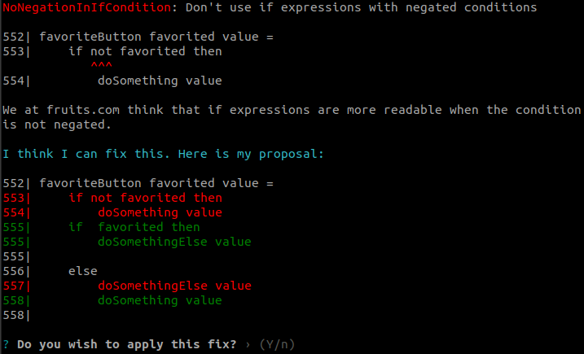
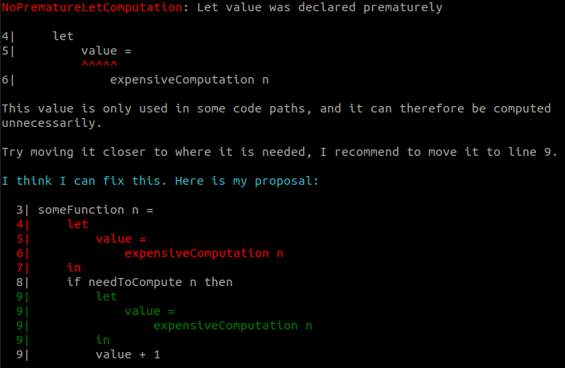

Some weeks ago I released version `2.5.0` of the `jfmengels/elm-review`.
It adds a feature allowing to get a portion of the source code as a string.

I'll explain what it does and how to use it, and then introduce some cool **newly published rules** that the feature makes possible.

## Extract source code

The new addition is [`withSourceCodeExtractor`](https://package.elm-lang.org/packages/jfmengels/elm-review/latest/Review-Rule#withSourceCodeExtractor),
which allows you to get an `extractSourceCode` function. It takes a `Range` (meaning a start and end position) and it will give you the source code in that range as a string.

For instance, if you have this source code:

```elm
module User exposing (User, user)

type User =
    User { name : String, role : Role }

type Role
    = User
    | Admin

user name =
    { name = name
    , role = User
    }
```

then you will get this result:

```elm
extractSourceCode { start = { row = 4, column = 10 }, end = { row = 4, column = 40 } }
--> "{ name : String, role : Role }"
```

These ranges are provided by the AST we're using in `elm-review`, meaning you'll rarely have to construct them like I did above.

> Why do we need this? I thought we were using visitors to analyze the AST.

Yes, and we will still do that, as that is generally more practical and precise. The purpose of getting the source code
is actually about allowing new kinds or improved automatic fixes.

Let's take the example of a rule that forbids negative conditions in `if` conditions, and wants to provide automatic
fixes. (Note: I actually wrote that [rule](https://github.com/jfmengels/elm-review/blob/master/tests/NoNegationInIfCondition.elm) as a test for this functionality, but I won't publish it because I don't think it's a good idea).

```elm
if not condition then
    -- this is the "then" branch
    1

else
    2
```

Consider that `elm-review` fixes only work by
[doing string manipulations](https://package.elm-lang.org/packages/jfmengels/elm-review/latest/Review-Fix#creating-a-fix):
inserting a string somewhere, removing a portion, and replacing a portion by a new string.

So what would a rule have to do to create a fix? It would have to remove the `not` and swap the contents of the branches.
And that's where things become really hard for `elm-review`, because one way or another you'll need to move or copy a
portion of the code at some point, which are not part of the available primitive fix operations. Try it out yourself!

A solution would be to stringify the AST corresponding to one of the branches using
[`the-sett/elm-syntax-dsl`](https://package.elm-lang.org/packages/the-sett/elm-syntax-dsl/latest/) for instance. That
would work, but the formatting of the code might be different from before, and comments in the branch would likely be lost.
This is generally not acceptable.

But... if we had a way to extract the source code and insert that somewhere, that'd be the same thing. And this is the
kind of thing this new feature now allows.

Back to the example, what we could do is ([example in code](https://github.com/jfmengels/elm-review/blob/master/tests/NoNegationInIfCondition.elm#L92-L96)):
- Copy the contents of the "then" branch
- Copy the source code between the "then" and "else" branch. In practice that is just the `else` keyword, but it would
  also contain all the whitespace around it, which is useful so we don't have to worry about indenting the keyword properly
- Remove the `not`
- Remove the portion corresponding to the "then" branch plus the "else" keyword, essentially moving the "else" branch to the "then" branch
- Insert the "else" keyword we copied before
- Insert the contents of the "then" branch

And that's it!




So what new rules are making use of this?

## NoPrematureLetComputation

My favorite from this batch of rules is [`NoPrematureLetComputation`](https://package.elm-lang.org/packages/jfmengels/elm-review-common/latest/NoPrematureLetComputation),
published in [`jfmengels/elm-review-common`](https://package.elm-lang.org/packages/jfmengels/elm-review-common/latest/).

It reports and moves `let` declarations as close as possible to where they're needed.

```elm
someFunction n =
    let
        value =
            expensiveComputation n
    in
    if needToCompute n then
        value + 1

    else
        0
```

In the example above, we unnecessarily compute `value` if `needToCompute n` returns `False`. We might as well
move that declaration to the "then" branch to avoid unnecessary work.



I believe this rule will make your code nicer by co-locating related variables, and improve performance by avoiding
unnecessary work (at no cost).

Declarations will be moved as close as possible to but not inside functions (lambdas or let functions with arguments),
as doing so could multiply the number of times the computation is done.

In some cases, you may not always see an automatic fix: When the declaration's body introduces variables, then moving it
can potentially result in compiler errors related to shadowing variables. As soon as the declaration introduces any
variable, even if it will in practice not cause a problem, then no fix is suggested. But the rule will be made smarter over time 😊

Also note that applying the suggested fix is not always the right approach. Just like deleted unused code, sometimes the
appropriate response is "this can't be right", and notice that there was a bug because a piece of code should have been
used.

During the testing phase for this rule, someone used it to find a bug: A variable was recommended to be moved to a branch
of an `if` expression, but in reality, it should have been used in both. I believe that this rule will allow you to find
these kinds of issues if you don't blindly accept the suggestions, but even if you do so, the code will be improved.


## NoSimpleLetBody

Again with `let` declarations, there is [`NoSimpleLetBody`](https://package.elm-lang.org/packages/jfmengels/elm-review-code-style/latest/NoSimpleLetBody).
This rule reports when a let expression's body is a simple reference to a value declared in the let expression.
This is somewhat of a stylistic rule, so I created a new package named [`jfmengels/elm-review-code-style`](https://package.elm-lang.org/packages/jfmengels/elm-review-code-style/latest/).

In the example below, the value of the `let` expression is a simple reference to `c` which is declared in the same `let`.

```elm
a =
    let
        b =
            1

        c =
            b + 1
    in
    c
```

I believe that we may as well move the contents of `c` to after the `in` keyword and omit declaring it, which
is what the rule reports and suggests an automatic fix for.


`NoPrematureLetComputation` will sometimes introduce this kind of code, so having a way to automatically clean that up is
pretty nice.

I wrote this rule before implementing the feature to extract the source code, and I was able to provide an automatic fix
by removing the `in` keyword and replace `c = ` by the `in` keyword. However, this would not work if `c` was not the last
declaration. So the new feature allows for providing an automatic fix in all cases.


## Afterword

I hope you like these additions! If you do, please consider helping out [your local Elm maintainers](https://github.com/jfmengels/awesome-elm-sponsorship) (or asking your company to do so)!
