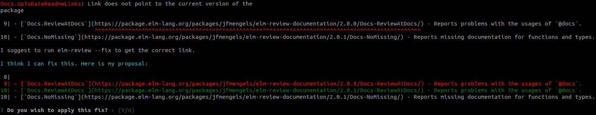

Hi all 👋

Today, I'm going to be talking about the new major version (v2) of
[`jfmengels/elm-review-documentation`](https://package.elm-lang.org/packages/jfmengels/elm-review-documentation/latest/).
It contains new rules that will help you fix mistakes in your documentation, both for Elm packages and applications.

I have been longing for this release for a while. In fact, if you go back to the
[announcement for `elm-review` v2](/elm-review-v2/#visiting-the-comments-and-documentation), you'll find mostly the same
ideas that I will go into here. I expected to work on this soon after that announcement, but I felt blocked by some
perceived limitations and believed that some other parts of `elm-review` would be more worthwhile to work on. At last,
this is now a thing, and I am super happy 🥳

Let's go over the available rules, shall we?

## Docs.UpToDateReadmeLinks

[This rule](https://package.elm-lang.org/packages/jfmengels/elm-review-documentation/latest/Docs-UpToDateReadmeLinks),
previously known as `Documentation.ReadmeLinksPointToCurrentVersion`, was the only rule available in v1. I
felt that the name was kind of long (I mean, the name kind of
[_stuck out_](https://package.elm-lang.org/packages/jfmengels/elm-review-documentation/1.0.3/Documentation-ReadmeLinksPointToCurrentVersion)
back then), so I renamed it, and that's the only breaking change for this release. I'll re-introduce the rule and its context for those not aware of it.

This is a rule specifically for Elm packages. The way one links to a module from the documentation is by having a Markdown link like
`[Module-Name](Module-Name)` or `[Module-Name](./Module-Name)`. While this works just fine when following the link from
the package's README on the [Elm package registry](https://package.elm-lang.org/), it doesn't when you read the
documentation on something like GitHub, because then this _relative_ link will not point to the expected location, which
sparked a nice discussion on the [Elm Discourse](https://discourse.elm-lang.org/t/problems-with-readmes-in-elm-packages/5396/).

The most common solution I've seen, and the one originally suggested in the thread was to use an absolute link to the
package registry. So for links in the README, instead of linking to `[Module-Name](Module-Name)`, you'd link to
`[Module-Name](https://package.elm-lang.org/packages/<author>/<package>/latest/Module-Name)`.

To avoid links getting out of date, you'd link to the `latest` version, as you can see in that example. The downside is
that links become "too up-to-date", meaning that if you follow a link from the README of an older version of a package
(on the registry or GitHub), you'll be forwarded to a newer version of the package, where the linked section or module
may not exist anymore.

The solution is then to instead use the current version, like
`[Module-Name](https://package.elm-lang.org/packages/<author>/<package>/1.2.3/Module-Name)`, which makes the links always
relative to the same version if done right, but authors would have to be careful to update that every time they want to publish.

And that's where this rule comes in: It finds all these links in the README and reports the ones that are relative, point to `latest`
or to a different version than the one found in `elm.json`, and reports them. Sorry, did I say "report"? I meant "fix"!



Thanks to this, I don't have to worry about updating my links anymore or having broken links in one of the versions of my package.

The way [I now publish a package](https://twitter.com/jfmengels/status/1359525871405699072) is by following these steps:
1. Run `elm bump`
2. Run `elm-review --fix-all` which updates these links to the newer version
3. Commit
4. Push
5. Wait for CI to automatically publish a new version thanks to [`elm-publish-action`](https://github.com/dillonkearns/elm-publish-action)

I actually have a script in all my packages (and in all packages created with `elm-review new-package`) that do 1 and 2
together, along with a pre-step of running tests, which makes publishing a safe and quick no-brainer.

Try it out:
```bash
elm-review --template jfmengels/elm-review-documentation/example --rules Docs.UpToDateReadmeLinks
```

## Docs.ReviewLinksAndSections

[`Docs.ReviewLinksAndSections`](https://package.elm-lang.org/packages/jfmengels/elm-review-documentation/latest/Docs-ReviewLinksAndSections)
is a very cool rule that I'm happy to see available.

It reports several kinds of documentation problems:
- Links to unknown modules, functions or sections. No more dead links!
- Links to non-exposed modules, functions or sections. No more forcing the user to look at the source code to know what you meant!
- Duplicate sections in the same file, for instance because `## Title` was found twice or because it was found once along with a `title` exposed as part of the module. This prevents one of the sections to be unlinkable.

I ran it on a few published packages, and it already found a number of issues. It also found issues in `elm-review`,
though it was partially on purpose. I remember myself not bothering re-checking all the new links when I was finishing
some documentation-heavy work because it was too tedious, but also because I was longing for this exact rule and for the
pleasure of finding problems through it. And it did!

A huge thanks to [`lue`](https://github.com/lue-bird) which spear-headed this work (and the focus on the rest of the package)
and solved the problems that blocked me!

Try it out:
```bash
elm-review --template jfmengels/elm-review-documentation/example --rules Docs.ReviewLinksAndSections
```

## Docs.ReviewAtDocs

[`Docs.ReviewAtDocs`](https://package.elm-lang.org/packages/jfmengels/elm-review-documentation/latest/Docs-ReviewAtDocs)
is a rule to report documentation killers.

A tiny bit of context for those who have not tried publishing an Elm package: Every exposed module of an Elm package has
a module documentation comment, which contains references to the exposed elements.

```elm
module Great.Things exposing
    ( Great(..)
    , Things
    , happen, here
    )

{-| This module does great things.

## Section about Great Things

@docs Great
@docs Things

## Section about things that happen here

@docs happen, here

-}

import ...
-- ...
```

The documentation is a blueprint of how the module's documentation will look like once published:
1. (Implicit) The title of the module: "Great.Things"
2. The text "This module does great things."
3. A header "Section about Great Things"
4. The signature of `Great` followed by its documentation
5. The signature of `Things` followed by its documentation
6. A header "Section about things that happen here"
7. The signature of `hapypen` followed by its documentation
8. The signature of `here` followed by its documentation

In summary, what `@docs` is for is to tell the registry "here is where you'll insert the documentation for X". 

Unfortunately, I have seen packages where the documentation was quite broken because `@docs` was slightly misused, in a
way that is not reported by the compiler, yet at the same time not parsed correctly by the package registry website.

So for instance if `@docs` is not at the start of the line, the package will still be publishable, but the resulting
documentation will literally be `@docs X`, instead of the injected documentation.

Reporting these kinds of issues is one of the aims of this rule, so that we can get rid of these problems in the package
ecosystem 🙂

---

The second aim for this rule is to reproduce all the documentation errors that the compiler gives when you run
`elm make --docs=docs.json`, including:
- missing `@docs` for exposed elements
- `@docs` referencing something that is not exposed
- duplicate `@docs` references for the same element

More on why a bit later.

In case some were wondering, [`elm-review-unused`'s `NoUnused.Exports`](https://package.elm-lang.org/packages/jfmengels/elm-review-unused/latest/NoUnused.Exports)
rule removes `@docs` references in its fix proposal when removing something from the exposed elements, so that the
cleanup experience is complete 🧹

Try it out:
```bash
elm-review --template jfmengels/elm-review-documentation/example --rules Docs.ReviewAtDocs
```

## Docs.NoMissing

[`Docs.NoMissing`](https://package.elm-lang.org/packages/jfmengels/elm-review-documentation/latest/Docs-NoMissing)
reproduces the checks the Elm compiler already gives for packages: when an exposed type or function does not have
documentation attached.

Additionally, it will report errors when a documentation comment is present, but **empty**.

I love the Elm package documentation and how you can construct it as you wish, meaning you can write the documentation
in a tutorial style, from easier to harder concepts, or even as a story if you're so inclined. This flexibility is in my
opinion a big factor as to why Elm packages usually have high quality documentation.

One common gripe I have is that I often see that the package authors assume that the documentation is read on the package
registry, from top to bottom, meaning that redundant functions are not always described when they feel redundant in their
context. For instance, if you've just described `map2`, then you may be inclined to not describe `map3`, since it's so similar.

But this way of accessing the documentation is not the only one. A number of developers access the documentation through
their IDE, where when you try to access the documentation for `map3`, all you'll get is an empty and unhelpful
documentation, without the surrounding explanation or context.

For that reason, I believe that there should be at least some minimal documentation, even something as simple as saying
`Same as [map2](#map2), but with three arguments` or giving a trivial example.

This rule takes some arguments: `rule : { document : What , from : From } -> Rule`. You can choose what to document,
either `everything` or `onlyExposed` modules, and where from: from `allModules` or only from `exposedModules` (for packages).

`Docs.NoMissing.rule { document = everything, from = onlyExposedModules }` would be the equivalent of what the Elm compiler reports, but you
can go a step further with the other options.

Try it out:
```bash
elm-review --template jfmengels/elm-review-documentation/example --rules Docs.NoMissing
```

## The start of a toolset for application developers

Why do most of these rules reproduce the compiler's behavior? Packages already benefit from them, right? They get to
know when documentation is missing, when `@docs` are missing or outdated, etc.

While that's absolutely true, that's not the case for **application** projects. We all know that documentation quickly
gets out of date, so application developers tend to write little of it even when it would be really valuable.

All the newly introduced rules have a secondary aim: to make sure that the documentation in applications is kept up
to date and of high quality, just as the Elm compiler and these same rules do for packages.

These will not fix everything, but I believe that any hint or warning you get that something is wrong or out of date can
help prevent outdatedness. If you stop exposing a function, and you're automatically asked to remove its `@docs`
reference, then perhaps you'll also notice that the example next to it used the function and take the opportunity to
update the example.

I don't believe this to be sufficient, but I think it's a good start for helping application developers write documentation.

Just like a test suite, if the quality is low and people don't use it often, then they'll start to see it as a nuisance
and a chore. But if you make it good, then people will use it more, improving it gradually and so on. It's either going
to be a vicious cycle or a virtuous cycle.

I hope to give you the tools to start creating a new habit that leans toward a virtuous cycle.

Did you know you can already visualize your application's documentation using
[`elm-doc-preview`](https://github.com/dmy/elm-doc-preview#applications-support)? Well, now you know, and maybe you'll
share that knowledge I recently came across to others.

Then maybe people will feel like documentation can be improved somehow, and extend it so that it generates interactive
examples from the module documentation or something like that. Who knows? I'm looking forward to see what people come up.

I don't think the available options for `NoMissing` are sufficient for applications, but I will need feedback on how to
best support that. [Please come discuss this!](https://github.com/jfmengels/elm-review-documentation/issues/15)


## Afterword

I hope you liked this release just as much as I did!

If you did enjoy it and want to support me, please head over to my [GitHub sponsors page](https://github.com/sponsors/jfmengels),
or better yet: tell your boss to do so 😁