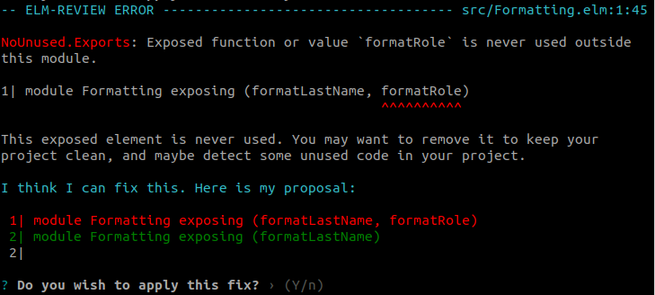
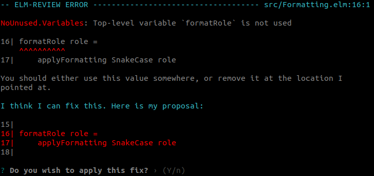
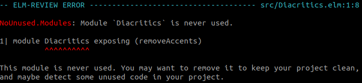

A few months ago, a colleague of mine [wrote this](https://twitter.com/jfmengels/status/1311940821378387970) on Slack:

> Thanks to elm-review I was able to remove ~7300 lines of code in the front end in 225 different files.
> Something I could have never done without its aid. Thank you Jeroen!

Also some time ago, I [tweeted this](https://twitter.com/jfmengels/status/1330854406615674883):

> Just cleaned up a lot of Elm code. I wanted to remove our usage of a module that brought no value. Manually removed the main places where it was used and followed the compiler errors. That was about 200 lines.
> elm-review took care of the other 2700 lines of the then dead code.

For scale, this was on a project of about 170k lines of code. Well, before the code removal. If we take what my colleague did, he was basically able to remove ~5% of the codebase, while touching ~30% of all files.

And **we felt good** about that.

I wanted to break down how [`elm-review`](https://package.elm-lang.org/packages/jfmengels/elm-review/latest/), a static analysis tool for [Elm](https://elm-lang.org/), was able to help us remove all this code almost effortlessly in a way that we felt very confident with. Spoiler: It's because of the lack of side effects in the language.

We are going to compare what code a static analysis tool for a side effect free language (Elm) is able to remove compared to for a dynamic and effectful language (JavaScript).

### Obscurity by impurity

I'll take the example of some JavaScript code because that's another language for which I worked a lot on static analysis.

```js
function formatUserName(user) {
  const userInfo = formatUserInfo(user)
  return user.name.first + ' ' + Formatting.formatLastName(user.name.last)
}
```

Did you notice in this example that `userInfo` was declared but never used? A static analysis tool (or linter if you will) can easily spot that, and it is a very common feature that they provide.

Now what should we do about this unused variable? If we wanted to clean up the excerpt above, the only thing we'd be able to do safely is remove the assignment of `formatUserInfo(user)` to `userInfo`, as shown below.

```js
function formatUserName(user) {
  formatUserInfo(user)
  return user.name.first + ' ' + Formatting.formatLastName(user.name.last)
}
```

We can't remove the call to `formatUserInfo(user)` because we don't know what it does. Maybe it mutates the `user` argument or global variables, makes HTTP requests, etc. In this example, I wouldn't be all _that_ surprised if `formatUserInfo` would mutate `user.name` by adding information from other `user` fields.

Those are called **side effects**: things that a function does in addition to or instead of returning a value. When a function has side effects, we say it is "impure", and we say it is "pure" if it doesn't have any.

The tricky thing with side effects is that the surrounding code may rely on those side effects being applied, but there is nothing in the code—that can't become stale—that indicates that dependency.

If a function is impure, then removing a call to it may change the behavior of the code. That means without knowing whether it is pure or impure, we can't **safely** remove it. For this article, I'll consider the removal of code "safe" if it won't change the behavior of the code or introduce compiler errors.

A smart static analysis tool could try to inspect `formatUserInfo` to see if it has side effects, but that can get very hairy. In some cases, it will even be outright impossible because of the inherent limitations of a static analysis tool on a dynamic language.

The more dynamic a language gets and the more it allows for side effects, the harder it will be for a static analysis tool to do an accurate analysis and reduce false positives and false negatives.

Here is an incomplete list of JavaScript features that make it hard to predict what the code will do:
- The [`eval` function](https://developer.mozilla.org/en-US/docs/Web/JavaScript/Reference/Global_Objects/eval) allows executing non-sandboxed arbitrary JavaScript contained in a string.
- Through [getters](https://developer.mozilla.org/en-US/docs/Web/JavaScript/Reference/Functions/get) and [setters](https://developer.mozilla.org/en-US/docs/Web/JavaScript/Reference/Functions/set), even an expression as simple as `a.b` can have side effects.
- Through changing the prototype of specific or core types, even standardized functions that are considered pure can become impure. This is actually a security issue and one of the reasons you get so many `dependabot issues` to bump [dependencies with vulnerabilities](https://snyk.io/vuln/SNYK-JS-LODASH-608086).
- Through macros (using Webpack or Babel for instance), the code may be transformed in unknown ways. In some cases, the tool won't be able to parse the untransformed code.
- Through dynamic imports (`require` or dynamic HTML script tags), arbitrary code—that the tool may not even have access to—can be imported and executed, potentially applying one of the features listed above.


### Clarity by purity

In Elm, you only have **pure** functions. Meaning that there is no observable difference between calling a function and not using the result, and not calling it at all.

In Elm, the previous uncleaned code snippet would translate to this:

```elm
formatUserName user =
  let
    userInfo = formatUserInfo user
  in
  user.name.first ++ " " ++ Formatting.formatLastName user.name.last
```

Here we could **safely**—without changing the behavior of the program—report that the whole declaration of `userInfo` can be removed, the call to `formatUserInfo` included, and propose to automatically fix it.


```elm
formatUserName user =
  user.name.first ++ " " ++ Formatting.formatLastName user.name.last
```

Why was the value unused? Either it lost its purpose at some point yet wasn't cleaned up, or this might be a bug lying around because it needed to be used somewhere but the developer who wrote/changed the code forgot to. Without talking to the developers directly we can't know in which situation we are in, and whether the value should be used or removed.

For that reason, when `elm-review` analyzes the code and it has been run with `--fix`, it will ask the user for confirmation before applying the suggested fix of removing the variable. Every `elm-review` fix proposal requires an approval from the user before it gets committed to the file system.

There is a way to batch them to avoid having the process be too tedious though, which I find people start to use after the tool has gained their trust.

### What more can we find?

In the rest of the article, I will refer to the change we did previously as step 1.

#### Step 2

In JavaScript-land, we would have had to keep the call to `formatUserInfo`, but in Elm-land, we were able to remove it. That allows us to do one more thing: check whether `formatUserInfo` is ever used anywhere else.

```elm
module SomeModule exposing (formatUserName)

import Formatting

formatUserName user =
  user.name.first ++ " " ++ Formatting.formatLastName user.name.last

formatUserInfo user =
  { role = Formatting.formatRole user.role
  , description = String.trim user.description
  }
```

When we look at this module, it seems that `formatUserInfo` is never used in any way: It is not exposed to the other modules nor is it used in any of the other functions. So we can safely remove it too!


#### Step 3

Let's look at the `Formatting` module, whose import we just removed.

```elm
module Formatting exposing (formatLastName, formatRole)

import Diacritics
import ReCase

type Capitalization
  = AllCaps
  | SnakeCase

formatLastName lastName =
  applyFormatting AllCaps lastName

formatRole role =
  applyFormatting SnakeCase role

applyFormatting formatting string =
  case formatting of
    AllCaps -> String.toUpper string
    SnakeCase -> ReCase.fromSnake (ReCase.toSnake (Diacritics.removeAccents string))
```

`elm-review` rules have the ability to look at all modules of a project before reporting errors. This makes it immensively more powerful than static analysis tools that only look at a single module at a time (like `elm-review` did originally, which I can tell you was very frustrating as a rule author). This approach allows us to report things about a module based on how it is used in other modules.

In this case, a different rule named [`NoUnused.Exports`](https://package.elm-lang.org/packages/jfmengels/elm-review-unused/latest/NoUnused-Exports) (previously we were using the [`NoUnused.Variables`](https://package.elm-lang.org/packages/jfmengels/elm-review-unused/latest/NoUnused-Variables) rule) will report that `formatRole` is exposed as part of the module's API but never used in other modules, `SomeModule` being the only module in the entire codebase where it was referenced. Since it's not used anywhere in the project outside of this module, we can safely stop exposing it from the module.

Note that if this was some kind of utility module that you *really* wanted to keep as is, you could disable this particular rule for that file. Also this rule does not report functions exposed as part of the public API of an Elm package, no worries there.

```elm
module Formatting exposing (formatLastName, formatRole)
-->
module Formatting exposing (formatLastName)
```




#### Step 4

Now it looks like `formatRole` was not used internally inside the `Formatting` module either, so we can remove it entirely just like we did for `formatUserInfo` back in step 2.




#### Step 5

`formatRole` was using the `SnakeCase` variant of `Capitalization` and that was the only location where that variant was ever created. If that variant is never created, we have no need to handle it.

For those not familiar with custom types (aka "union types" aka "algebraic data types") but familiar with JavaScript, they allow you to list all the discrete values that something can have. When used in a `case` expression (roughly equivalent to a `switch` in JavaScript), the compiler can determine whether you have handled all possible values and remind you when you haven't, removing the need to add a default case.

```js
function applyFormatting(formatting, string) {
  switch (formatting) {
    case "AllCaps": // ...
    case "SnakeCase": // ...
    default: // Not necessary in Elm because all cases are handled
}
```


This is the first case where an automatic fix is not offered (EDIT: this is also handled automatically nowadays!), because we will need to remove the variant both in the custom type definition and in the different patterns, potentially in multiple files. In this case, it's safer to let the user remove the definition themselves and let the Elm compiler help them fix all the compiler errors that causes.

~~A tool could potentially do it, but at least for now, `elm-review` doesn't.~~ This is how the user would likely remove the unused variant.

```diff
...

type Capitalization
  = AllCaps
- | SnakeCase

...

applyFormatting formatting string =
  case formatting of
    AllCaps -> String.toUpper string
-   SnakeCase -> ReCase.fromSnake (ReCase.toSnake (Diacritics.removeAccents string))
```


#### Step 6

In the last step we removed the call to the `removeAccents` function from the `Diacritics` module, which that was the last usage of that import in the module.

In JavaScript, importing a module can cause side effects. Meaning that in order to not change the behavior of the program, we can only remove the assignment part from the import declaration.

```js
import defaultExport from 'module-name'
// -->
import 'module-name'
```

In Elm, importing a module is free of side effects. Meaning that we can safely remove the whole import.

Similarly, the import of `ReCase` has become redundant, so we can remove it in the same manner (let's count that as step 6.5 for brevity's sake).


then


#### Step 7

[`NoUnused.Modules`](https://package.elm-lang.org/packages/jfmengels/elm-review-unused/latest/NoUnused-Modules) tells us that the `Diacritics` module that we created in our project is actually never imported anywhere. Well, if we never import the module, we can remove the entire file!



Once that file has been removed, we could look at all the functions and types defined in the modules `Diacritics` imported.

#### Step 8

(This would have been reported at the same time as step 7)

Similarly but in a slightly different way, [`NoUnused.Dependencies`](https://package.elm-lang.org/packages/jfmengels/elm-review-unused/latest/NoUnused-Dependencies) reports that the `s6o/elm-recase` dependency that we defined in our `elm.json` is unused.

Since we removed the only import of the `ReCase` module contained in that dependency and there are no other imports of modules from that package left in our codebase, we can safely remove the dependency from the project.


(EDIT: Once again, an automatic fix is provided nowadays 🥳)

### Recap

Let's do a recap of what we have changed using `elm-review`.

```diff
module SomeModule exposing (formatUserName)

import Formatting

formatUserName user =
- let
-   userInfo = formatUserInfo user
- in
  user.name.first ++ " " ++ Formatting.formatLastName user.name.last

- formatUserInfo user =
-   { role = Formatting.formatRole user.role
-   , description = String.trim user.description
-   }
```

```diff
-module Formatting exposing (formatLastName, formatRole)
+module Formatting exposing (formatLastName)

-import Diacritics
-import ReCase

type Capitalization
  = AllCaps
- | SnakeCase

formatLastName lastName =
  applyFormatting AllCaps lastName

-formatRole role =
-  applyFormatting SnakeCase role

applyFormatting formatting string =
  case formatting of
    AllCaps -> String.toUpper string
-   SnakeCase -> ReCase.fromSnake (ReCase.toSnake (Diacritics.removeAccents string))
```

Those modules have become a lot shorter. Additionally, we removed the entire `Diacritics` module and a dependency.

### Purity means clear dependencies

Searching for unused code is similar to searching in [directed graphs](https://en.wikipedia.org/wiki/Directed_graph), one graph where each function (or value/constant) is a node, another graph where each module is a node, etc.

Side effects are a way for one piece of code to implicitly depend on another one, adding fuzzy and unpredictable arrows in our graph which makes it unreliable for analysis. In other words, a **pure functional language**—with its lack of side effects—simply makes the dependencies between pieces of code explicit.

With each step we went through, we removed dependencies between pieces of code. After removing enough of those, we end up with a sub-graph not connected to the main program—or rather that the main program does not depend on—that we can therefore safely remove.

For effectful languages, even if a static analysis tool reported or removed some of the example code we showed, we would have to double check its work to make sure it didn't make any unsafe changes. Because of their inherent dynamic nature, these automatic fixes would often be heuristics rather than guaranteed safe changes.

The paradigm of a static, side effect free language allows us far greater possibilities that we can perform safely.


### YAGNI (You Aren't Gonna Need It)

I have been doing [a](https://twitter.com/jfmengels/status/1336567810793893889) [lot](https://twitter.com/jfmengels/status/1337803716737560577) [of](https://twitter.com/jfmengels/status/1337805942029774851) [work](https://twitter.com/jfmengels/status/1337910280953716738) recently to find more and more dead code in Elm, for instance by discovering unused functions in code paths that can't ever be reached.

Is it valuable for you to be pedantic about deleting potentially useful code and for me to chase after dead code so much? I would love to say it is not, but as we saw in this example, it is only because we were so pedantic that we were even able to start this process.

Had we left the let variable in our example, we wouldn't have been able to continue gnawing away at the graph and finally end up removing entire portions of the code.

Even when code feels safe to remove, you can feel like you should keep some of it, just in case it will be useful later. As mentioned previously, you can somewhat ignore these rules on select pieces of your codebase, but apart from isolated utility functions (potentially), I would advise against doing so.

I have started embracing YAGNI (You Aren't Gonna Need It) and removing everything I could safely remove, knowing that I have a Git history I can rely on and knowing that the code I could have kept may not even fit the needs of the situation I'm trying to keep it for.

Until the time comes where the code is actually used, keeping it will have a negative value in readability since dead code can be misleading and distracting. It will also have a negative value in maintenance because even if it serves no purpose it will need to be maintained.

In contrast, reporting unused code has the positive value of warning you about the obvious bug where you are not using what you recently defined and should have used. I have been reminded of this several times already by colleagues who told me `elm-review` had found such a bug in their code.

I wouldn't spend much time trying to find unused code manually because of how time-consuming of a task that is. But since we have tools to do this automatically and in very reasonable amounts of time, I find the cost to be quite low and the value quite high.

Marie Kondo says that if something doesn't bring you joy, you should throw it away. In my case, after I refactor some code, I run `elm-review` and hope that it will start finding things to throw away. As [Martin Janiczek says](https://twitter.com/janiczek/status/1330940781083947008):

> It's such a joy to be reminded by elm-review that you can now delete some dead code!

Always leave your codebase cleaner than you found it. Especially when that becomes easy.
