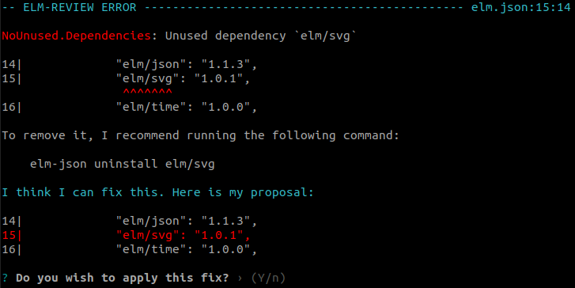
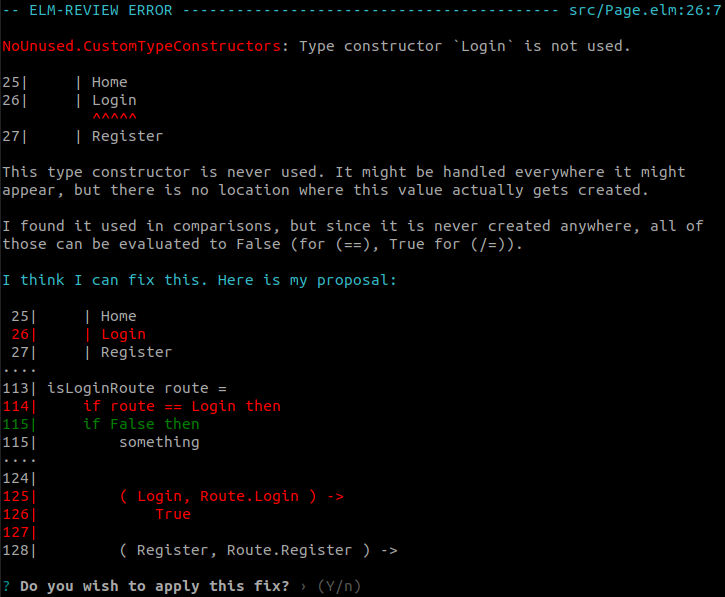

Today, I'm releasing a new version (1.1.9) of [`jfmengels/elm-review-unused`](https://package.elm-lang.org/packages/jfmengels/elm-review-unused), and releasing a very exciting new `elm-review` package!

Highlights:
- [Unused dependencies get removed automatically](#automatic-fixes-for-unused-dependencies)
- [Unused constructors get removed automatically](#automatic-fixes-for-unused-constructors)
- [Releasing `elm-review-simplify` to simplify your code](#automatic-fixes-for-a-lot-of-things)

### Automatic fixes for unused dependencies

I hinted at this coming in the [last release](/global-and-configuration-errors), but [`NoUnused.Dependencies`](https://package.elm-lang.org/packages/jfmengels/elm-review-unused/latest/NoUnused-Dependencies) now proposes a fix for removing your unused dependencies.



As you may have seen recently if you were a target of such a pull request or if you've read the announcement, [Martin Stewart](https://github.com/MartinSStewart/) created [a bot to remove unused packages from dependencies](https://discourse.elm-lang.org/t/i-created-218-pull-requests-in-3-days/7276) using [Lamdera](https://lamdera.app/) and `elm-review`.

Martin added the automatic fix for removing dependencies on packages, and I did it for applications. He also made the rule report unused test dependencies, so if you notice new reports for unused dependencies, don't be surprised! Thanks a lot for working on this Martin!

### Automatic fixes for unused constructors

In v1.1.5 [in other posts](/unused-patch-1-1-5/#detection-of-custom-type-constructors-that-will-never-be-used) that `NoUnused.CustomTypeConstructors` got a lot smarter and become able to report some constructors that looked used but weren't.

In this version, the rule now proposes automatic fixes!



`elm-review` only supports fixes for a single file at a time, so you'll see this if a constructor is only ever referenced or pattern matched in the file it was defined in.

```diff
type Model
  = Loaded String
- | Loading

view model =
-  	if model.state == Loading then
+  	if False then
	   viewLoading model

	else
	   viewLoaded model

viewLoaded model =
    case model of
        Loaded message ->
            text message

-       Loading ->
-           text "Loading..."
```

The annoying thing with this, is that you may end up with code like the `if False then`, which seems kind of dumb. 

Thankfully, this is not the end of the announcement 😀 

### Automatic fixes for... a lot of things

I'm releasing a new `elm-review` package called [`elm-review-simplify`](https://package.elm-lang.org/packages/jfmengels/elm-review-simplify/latest/).
It has a single rule named [`Simplify`](https://package.elm-lang.org/packages/jfmengels/elm-review-simplify/latest/Simplify) and its aim is to provide automatic fixes that simplify your Elm code.

Here are a few examples of what it does:

```elm
if False then x else y
--> y

List.map identity list
--> list

List.map fn []
--> []

a :: [ b ]
--> [ a, b ]

[ a ] ++ list
--> a :: list

(\_ y -> x) data
--> (\y -> x)

Cmd.batch [ cmd ]
--> cmd
```

Just as a small piece of history for me: I used to write a lot of ESLint rules to make JavaScript code more secure and nicer, and I was very frustrated because we would not be able to tell some simple things with confidence, such as whether `a.map(b => b)` could be simplifiable to `a`. The linter and/or the language couldn't be sure that the data was an array even when it very much looked like it because it could be an arbitrary or custom data structure with a `map` function that did something surprising.

I'm therefore really happy that about 5 years later I'm finally able to make these kinds of transformations with high confidence that it won't break the user's code. 🎉

The rule applies a ton of small iterative fixes, with the hope that it will break down seemingly complex code into simpler code.

Let's take this code that I recently found as an example:

```elm
let
  prefix =
    String.slice 0 index str

  prefix_ =
    if String.length prefix > 0 && (not <| String.endsWith " " prefix) && (not <| String.endsWith "\n" prefix) then
      prefix ++ ""

    else
      prefix
in
-- ...
```

What `Simplify` would first do is to transform `prefix ++ ""` to `prefix`, because concatenating with an empty string does not change the value.

We then have `if ... then prefix else prefix` which gets simplified to `prefix`.

We end up with this:
```elm
let
  prefix =
    String.slice 0 index str

  prefix_ =
	prefix
in
-- ...
```

I imagine at some point there could be a rule to remove or report this unnecessary `prefix_`, resulting in even less code.

At one point in time the code above used to have a purpose (it did `prefix ++ " "`), but as it changed it ended up not bringing any value, even though that was not clear at first sight.

If we go back to `NoUnused.CustomTypeConstructors`, here's the kind of scenario that I tried to make nicer:

```elm
type alias Item =
  { name : String
  , location : Location
  }

type Location
  = InTheKitchen
  | InTheBathroom
  | InTheGarden

getItemsFromTheGarden : List Item -> List String
getItemsFromTheGarden items =
  items
    |> List.filter (\item -> item.location == InTheGarden)
	|> List.map (\item -> { item | name = item.name ++ " (from the garden)" })
```

Should we notice that `InTheGarden` is never used (because you recently moved to a flat in Paris for instance), then `NoUnused.CustomTypeConstructors` will suggest this fix:

```diff
type alias Item =
  { name : String
  , location : Location
  }

type Location
  = InTheKitchen
  | InTheBathroom
- | InTheGarden

getItemsFromTheGarden : List Item -> List String
getItemsFromTheGarden items =
  items
-   |> List.filter (\item -> item.location == InTheGarden)
+   |> List.filter (\item -> False)
	|> List.map (\item -> { item | name = item.name ++ " (from the garden)" })
```

`Simplify` will then take over and do

```diff
getItemsFromTheGarden : List Item -> List String
getItemsFromTheGarden items =
- items
-   |> List.filter (\item -> False)
+ []
	|> List.map (\item -> { item | name = item.name ++ " (from the garden)" })
 ```
 then

```diff
getItemsFromTheGarden : List Item -> List String
getItemsFromTheGarden items =
  []
-	|> List.map (\item -> { item | name = item.name ++ " (from the garden)" })
```

Now through the magic of tiny steps, we notice that the function does pretty much nothing anymore. [`NoUnused.Parameters`](https://package.elm-lang.org/packages/jfmengels/elm-review-unused/latest/NoUnused-Parameters) will now report that the `items` parameter is not used, at which point (because that rule doesn't provide an automatic fix) you might address the issue by removing the function entirely.


### Benefits of Simplify

#### An elm-format-like platform

As discussed on the [Elm Radio episode about elm-format](https://elm-radio.com/episode/elm-format), Dillon and I write terrible-looking Elm code, and let `elm-format` clean it up for us. Similarly to that, I want `Simplify` to be a platform that users and other rules can rely on to do the dirty work.

`NoUnused.CustomTypeConstructors`'s job is to report and remove constructors, nothing more. It will sometimes change code to `condition || False` by necessity, but doing anything more will in practice be pretty complex to do. The existence of `Simplify` allows `NoUnused.CustomTypeConstructors` to write dumb code and get away with it.

Similarly, this rule relies heavily on `elm-format` being applied after `elm-review` (which happens automatically 😉) because writing beautiful fixes is hard (again, fond memories of doing this in ESLint when formatters were not widely adopted).

#### Detecting hardcoded code or bugs

Dillon and I also like to do work in [tiny incremental steps](https://elm-radio.com/episode/incremental-steps), and that sometimes includes writing very dumb or hardcoded code, which Dillon presented well in his [Elm Europe talk](https://www.youtube.com/watch?v=mrwn2HuWUiA). It's possible that we forget to make some code more general-purpose and therefore keep some of the hardcoded code in there. In this case, `Simplify` would report errors that would remind us to finish the abstraction.

Just like all the `NoUnused` rules, having this rule trigger when you don't expect it can be a sign that something fishy happened, like an unexpected bug. Applying the fix is not always the right course of action (don't accept fixes blindly!), and sometimes you have to go look at what change led to unused or simplifiable code and undo the root cause.

When applied fully, and as seen in an example above, I hope that simplifying code will lead to detecting unused code, which as I have [described elsewhere](/safe-dead-code-removal) can trigger a snowball effect of other code.

#### Reducing production build sizes

I know of some people wanting to be able to remove code like `if IS_PRODUCTION then [code] else [code, devCode]` from their production builds, where `IS_PRODUCTION` would be injected by a build script.

Running `Simplify` on the built Elm code could remove references to `devCode` and reduce the production build by a few kB by taking advantage of Elm's dead code elimination (which would otherwise not kick in in this case).

In some cases, `Simplify` will make the code run a tiny bit faster because it will remove operations. I don't think it will be noticeable though.

#### More idiomatic Elm code

Thanks to the wide-spread adoption of `elm-format`, Elm's small language and The Elm Architecture, Elm code in one codebase tends to look like Elm code in another codebase, and I'd like to make it even more so.

I have decided on some "simplifications" that takes code written one way and change it another that I think is more idiomatic in Elm. I think I have been pretty conservative and limited with my choices though. Here are a few things it does:

- Changing `case .. of True -> ...` to `if .. then .. else` (more idiomatic) and `[ 1 ] ++ [ 2 ]` to `[ 1, 2 ]`
- Using dedicated functions when available, like going from `String.join "" list` to `String.concat list`

#### Goal: Don't lose the code's intent

On that note, **I don't want** the rule to be too annoying or restrictive in how people write their code though, and I want people to keep writing code in a way that makes sense to them.

The rule will not change `milliSecondsInADay = 1000 * 60 * 60 * 24` to `milliSecondsInADay = 86400000` because it would lose some of the developer's potentially valuable intent.

Changing `List.map f [ a, b, c ]` to `[ f a, f b, f c ]` is also something the rule won't do, because that could make the code longer or more annoying to write, even if in some sense it could be considered simpler.

Also, changing `(\data -> fn data)` to `fn` won't be done, because good names can make the code more readable in some contexts.

That said, the rule will trigger if some part of the code removes the usefulness of other code. So `milliSecondsInADay = 0 * 1000 * 60 * 60 * 24` would be turned into `milliSecondsInADay = 0` because the rest is redundant.

I think most value of the value is removing the cruft that seems unnecessary, because that's when you'll detect bugs or unnecessarily complex constructs.


### Future of elm-review-simplify

There will likely be a lot more simplifications integrated in the future. I wrote down a few I have already identified [in an issue](https://github.com/jfmengels/elm-review-simplify/issues/2). Let me know if you'd like to work on implementing some simplifications!

Also, feel free to suggest new ones in new issues if you think of some. But please understand that if it's too complex, too much work or something I don't intend to support, I may not want to include it.

For instance, I still don't know whether I want to support simplifications for packages other than `elm/core` or other `elm/*` packages, like the `elm-community/*-extra` packages.

Others could publish similar rules for those and we'll see how that will evolve. Do get in touch with me if you want to contribute something similar to the community though!

Also, I put little effort into making nice and consistent error messages and details for this rule as the main use was to simplify the code, and not explain why some things are equivalent. But the rule could be helpful for newcomers if it provided better error messages. If you want to help out with the quality or consistency of those, please contact me!

### Try it out

```bash
# Install the latest version of elm-review, just in case
npm install -g elm-review
elm-review --template jfmengels/elm-review-simplify/example --fix

# And don't forget the latest version of elm-review-unused!
elm-review --template jfmengels/elm-review-unused/example --fix
```

I'd love for you to try out what simplifiable code you can come up and figure out whether this rule will find it!