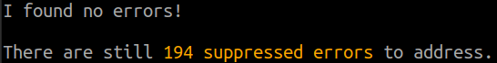
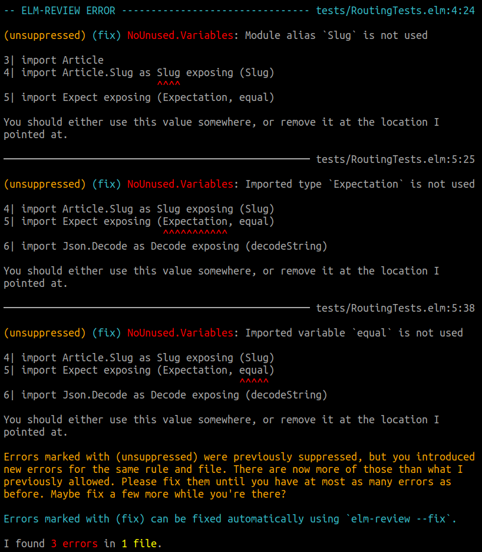
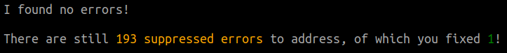
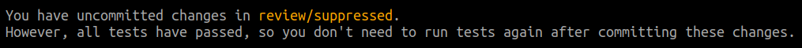

_Nothing to do with the release, but please consider giving your blood at your local blood donation center. This saves people's lives and there is always a demand!_

As much as people like to say that copy & pasting is bad, it still happens a lot, either by a real copy & paste or by
taking inspiration from existing code in the codebase. When "good" code gets replicated, no problem. When bad code gets
replicated, that's not good.

A good way to increase the quality and maintainability of a codebase is by stopping the bleed: identifying then
preventing bad patterns from being replicated over and over, and little by little tackle these issues until only "good"
code is left (warning: getting to the end might be hard).

`elm-review` has always been a tool basically to tell you not to do something, but it was never really able to tell
people to **stop** doing something, because that required having fixed all the problems beforehand.

In this blog post, I will describe a new major feature for `elm-review` which will help with just that: `elm-review suppress`.
It's a new system for making it much easier to add rules incrementally. I'll describe it below, and then show an
exciting application and new rule that revolves around reporting deprecated code.


## Enabling rules can be hard

I really love `elm-review` rules. I love writing them, enabling them and having them report errors so that I don't
have to spend any brain power thinking about those issues. (Though it has the opposite effect for me: writing those rules
makes me extra sensitive to the reported concerns. Thank you brain...)

To benefit from those rules, a mandatory step is to enable the rule in the review configuration, at which point it may
reveal no errors, or mountains of them. And when it does the latter, things get complicated because of `elm-review`'s
approach on rules (no warnings, no disable comments, ...) doesn't let you have unfixed reported errors.

So that gives you the choice between several options.

Option 1 is to go and fix all the errors before enabling the rule. If you have a big codebase and, let's say, 2000 errors
for the new rule, then this can turn into a large amount of time and effort that may not be worth prioritizing,
or maybe not even worth the effort at all. Also, while you're busy fixing errors, new errors can be introduced, because
you still haven't enabled the rule yet.

Option 2 is to enable the rule, and use `Rule.ignoreErrorsForFiles` with the list of all files that the rule currently
reports errors for. The rule will be enforced for the rest of the project, which is great, but ignored for the
aforementioned files, meaning it's possible to introduce more errors in those. Also, unless you add comments in your
review configuration, it can be hard to know whether the ignored files are there temporarily and should be fixed, or purposefully and
permanently ignored.

Option 3 is to not enable the rule, or wait until you get a bright idea, until the rule gets automatic fixes, or until
stars align. If the rule is indeed useful, then it's a shame to have it end this way.

None of these options are perfect. I usually end up going with option 2, but there are also times when I go for 1 or 3.

Well, `elm-review suppress` is option 4, and it's the option I now always go for.


## elm-review suppress

The new `elm-review suppress` allows you to mark a certain number of errors as temporarily suppressed, meaning they won't be
reported and cause `elm-review` to exit with an error code.

How does it work? Let's say you add a new rule to your review configuration, and it reports a bunch of errors.

You then run `elm-review suppress`, which creates a "suppression file" under `review/suppressed/` (`review/` being the folder
containing your review configuration) for every rule that reported errors. So if `NoUnused.Variables` was reporting
errors, you'd get the following `review/suppressed/NoUnused.Variables.json` file:

```json
{
  "version": 1,
  "automatically created by": "elm-review suppress",
  "learn more": "elm-review suppress --help",
  "suppressions": [
    { "count": 12, "filePath": "src/Article/Feed.elm" },
    { "count": 8, "filePath": "src/Page/Settings.elm" },
    { "count": 2, "filePath": "tests/RoutingTests.elm" },
    // and some more...
  ]
}
```

Now, when you run `elm-review` the way you usually do, `elm-review` will not report any errors.



Every suppression file tallies how many errors are being reported for the associated rule for a given file, and does so for
every file that have errors reported for.

What `elm-review` does with these files is the following: it reviews the project the way it usually does, then it groups
the reported errors per rule and file. If the number of errors in a group corresponds to the tally in the suppression file,
they all get suppressed and none get reported.

What if you introduce a new errors you ask? Then all the errors from that group get reported again (they get "unsuppressed").



Since `elm-review` only keeps track of a tally, it doesn't know which errors are new and which ones were previously
suppressed, so all errors in the rule+file group get reported. As the user, you only need to fix enough errors to go back
to the previous tally, but you are welcome to fix more.

What if instead you fix one of the suppressed errors? Then we celebrate!



(I wanted to have 🥳🎉 emojis, but terminals don't all like that 😢)

In addition to celebrating, `elm-review` also automatically updates the suppression file.

```diff
{
  "version": 1,
  "automatically created by": "elm-review suppress",
  "learn more": "elm-review suppress --help",
  "suppressions": [
    { "count": 12, "filePath": "src/Article/Feed.elm" },
    { "count": 8, "filePath": "src/Page/Settings.elm" },
-   { "count": 2, "filePath": "tests/RoutingTests.elm" },
+   { "count": 1, "filePath": "tests/RoutingTests.elm" },
    // and some more...
  ]
}
```

The suppression system allows us to temporarily ignore some errors, but we still don't want new errors from showing up.
I find that automatically updating the suppression files helps with that. 

If you run in `--watch` mode, then these get updated as soon as you save your changes, so if you fix an issue and soon
after introduce a different one, then that one will be reported (as the tally is higher than in the suppression file).

If you don't run `elm-review` often, then it is possible to have errors exchanged for another one (for the same rule and file).
But that is also the worst that can happen with this system.

## elm-review suppress --check-after-tests

`elm-review` won't exit with an error code when there are no outstanding errors and suppressed ones got fixed. If you
run your local test suite and it forces you to re-run the test suite just because you fixed some errors, then it kind of
feels like punishing you when you did the right thing. And I want to nudge you towards doing the right thing.

The biggest downside, or annoyance, that I found with updating the suppression files automatically and having
`elm-review` not fail when that happens, is that some people may forget to run the test suite (and therefore updating the
suppression files) and/or committing the files, before making a pull request. Then the CI passes, the PR gets merged,
and now other people/branches start getting unrelated suppression file changes in their pull request.

To counter that, `elm-review` has a handy command that you can run at the end of your tests, that checks whether there
are uncommitted changes in `review/suppressed` (using Git).

If there are none, it exits with a success code. Otherwise, it exits with a failure code and lets you know that you need
to commit these files, but that you also don't need to bother running your tests again, since they all otherwise passed.



```bash
# Example test suite
elm-format src/ tests/ --validate \
  && elm-review \
  && elm-test \
  && elm-review suppress --check-after-tests
```


## Tackling suppressed errors

As you may have seen, you still have a reminder of how many suppressed you have, hopefully nudging you towards
tackling these errors from time to time. But you still need the tools to do so.

`elm-review` now has these additional flags:
- `--unsuppress`: Unsuppress all suppressed errors, meaning they will now be reported
- `--unsuppress-rules <rule1,rule2,...>`: Unsuppress errors only for the given rules

I recommend using combinations of `--unsuppress-rules`, `--watch` and `--fix`/`--fix-all` (maybe even `--rules`
if the feedback feels slow) to tackle the issues. That way, you get automatic fix suggestions and the suppression files
get updated in real time.

You can also manually remove lines from a suppression file, so that the associated suppressed errors start being
reported again. I have found this to be pretty useful to tackle errors in chunks.


## Reporting deprecations

Code changes all the time, and code you thought was good at one point in time may turn into code you want to get rid of
later. Because it doesn't reflect the domain correctly, because it is bug-prone, because it is hard to maintain, or for
plenty of other reasons.

When your point of view changes, either you remove it and replace it by a better solution right away, or — when doing so
would be more work than you have time for right now — you deprecate it, sometimes in your head and sometimes in writing.

Deprecated code is code that should be replaced and that should not be replicated.

As mentioned before, `elm-review` was not a tool to **stop** doing something, and writing a rule for reporting
usages of deprecated things was therefore just not a good fit.

But the new suppression system allows us to write just that kind of rule, and I have published the [`NoDeprecated`](https://package.elm-lang.org/packages/jfmengels/elm-review-common/1.2.0/NoDeprecated) rule
in the [`jfmengels/elm-review-common`](https://package.elm-lang.org/packages/jfmengels/elm-review-common/latest/) package.

This rule reports any usage of values/types/modules/dependencies that are tagged as deprecated. This is I believe a
very useful rule that was simply not practical without the suppression system.

The main way of tagging things is through the name: if something contains "deprecated" (in a case-insensitive way) in
its name, then it gets reported. This is most practical for application code where you can rename things freely. Having
an obvious **"DEPRECATED"** that stands out also makes the deprecation obvious when looking at or reviewing code, even
without tools or in Git diffs.

```elm
import DeprecatedModule

a = DeprecatedModule.view "..."

b = Button.view_DEPRECATED "Click me!" OnClick
```

The secondary way to deprecate things is through the documentation comments: If an element has a documentation comment
where one of the lines starts with `@deprecated`, then it is tagged as such.

This `@deprecated` tag is neither an official nor a standard way to deprecate something, because there is neither in the Elm community.
I made a proposal in this [Discourse post](TODO link), and I'd love to have feedback so that we can make something nicer
together.

For dependencies, you can configure the rule to report usages of elements from specific dependencies, in case you want
to migrate away from it.


## Try it out

The suppression feature is available as a beta version at the moment, so I can collect feedback and change or remove things around the
suppression system. It seems to work nicely so far, but maybe there are problems to uncover.

To try it out, you will want to run the following command:

```bash
npm install elm-review@beta -- you want 2.7.0-beta.3 or later

# then get started with
elm-review suppress --help
elm-review suppress
```

If you want to try out the [`NoDeprecated`](https://package.elm-lang.org/packages/jfmengels/elm-review-common/1.2.0/NoDeprecated)
rule, you can run:

```bash
elm-review --template jfmengels/elm-review-common/example --rules NoDeprecated
```


## Afterword

I really hope you find this feature interesting and useful, I sure do. I hope that you will feel like you can enable all
the rules you previously wanted to enable, but couldn't because of the issues I mentioned.

You can learn more about how to use it by running `elm-review suppress --help`.

If you're interested, I wrote about some of the [goals I had for this feature](https://github.com/jfmengels/elm-review/blob/master/documentation/design/suppress.md),
which should explain why it is designed the way it is. A special thanks to Dillon Kearns for his input and advice!

I haven't mentioned it yet, but by far the biggest downside of this feature for me is how easy it now becomes for people
to ignore errors, for bad or slightly okay reasons. For your own sake, I hope you don't misuse this feature in that way.

I am open to feedback, which you can share either in the #elm-review channel in the ELm Slack, in
a [GitHub issue](https://github.com/jfmengels/elm-review/issues/new), or in the [Discourse post](TODO link) for this
announcement. Please also pitch in for the [discussion around deprecation](TODO link).

As usual, if you want to support me or `elm-review`, you can do so through [GitHub sponsors](https://github.com/sponsors/jfmengels/).
If your company benefits from my work, please consider asking your boss to help me out.

Also, I would really like to have more people helping out and involved in the project, so if you feel like contributing
(even if you don't have an idea of how), hit me up on Twitter or Slack!
