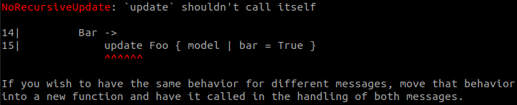
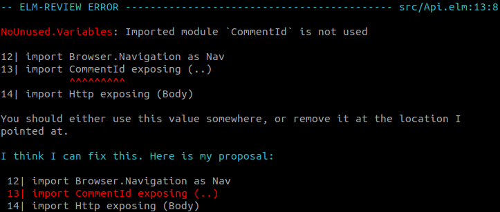
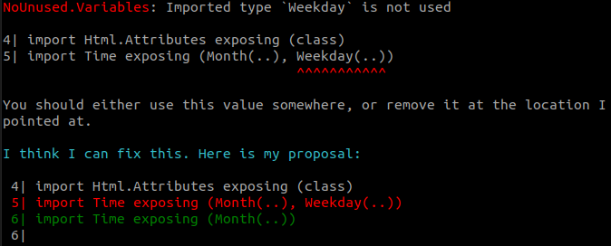
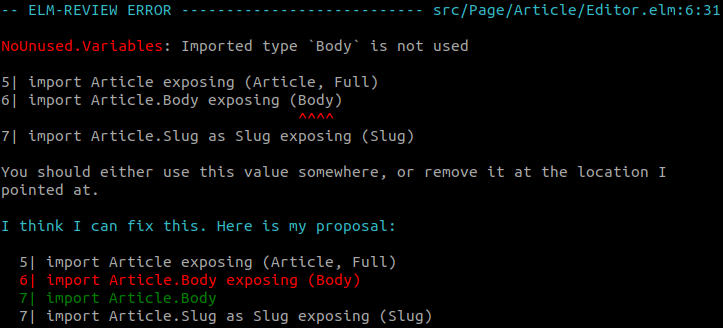
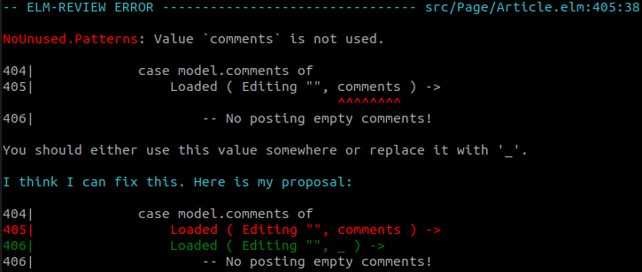

Today I'm releasing a **big** patch release for [`elm-review-unused`](https://package.elm-lang.org/packages/jfmengels/elm-review-unused/latest/), [`elm-review`](https://package.elm-lang.org/packages/jfmengels/elm-review/latest/)'s main package to detect and remove unused code from Elm code.

I wrote earlier on how [`elm-review`](https://package.elm-lang.org/packages/jfmengels/elm-review/latest/) and this package are [so good at detecting and removing dead code](/safe-dead-code-removal), and I hinted at some of the changes included in this release.

Let's go over what this package is now capable of detecting that it wasn't before!
By the way, all of the examples come from [`rtfeldman/elm-spa-example`](https://github.com/rtfeldman/elm-spa-example), after removing everything that was reported by the previous patches (and you would be surprised how much dead code is in there!).

### Recursive let functions

We usually detect unused functions by counting how many times they are referenced. If the count is 0, then we consider it unused. Recursive functions reference themselves (by definition), meaning that to notice when one such function is unused, there needs to be some special handling.

`NoUnused.Variables` already reported recursive functions which are never called, but we didn't do this for functions defined in a let expression.



The next step in this direction would be to detect unused indirectly-recursive functions. Things like `a` calling `b` calling `a` where neither is referenced elsewhere. That would be a bit trickier to keep track of, but it's definitely do-able!

## Better handling of imports

### Unused imports that import everything

This one has been a thorn in my side for such a long time, especially since some editors would tell you about them already.



### Unused type imports that expose the constructor

Similarly, we were not reporting the exposing of a custom type even when that was possible.



If in the example above, the type `Weekday` was used in a type annotation but its constructors were not, then the proposed fix would be to only remove the `(..)`.

Removing imports does not provide a lot of value in practice, because `NoUnused.Exports` would already report what was exposed but never used in other modules. It is mostly a cosmetic thing. That said, it will help detect unused dependencies, and help you avoid potentially unnecessary [import cycle errors](https://github.com/elm/compiler/blob/9d97114702bf6846cab622a2203f60c2d4ebedf2/hints/import-cycles.md).

Side-note on that: `elm-review` now reports more accurate (often shorter) [import cycles than the compiler](https://twitter.com/jfmengels/status/1364676791185661961). I will try to improve that a bit more then report back so that the Elm compiler can incorporate those lessons.

### Shadowing imported elements

Elm famously doesn't allow [shadowing variables](https://github.com/elm/compiler/blob/master/hints/shadowing.md). Except that it does, when you override something that was imported from another module.

That makes somewhat sense because you don't want code like the following to not compile because `text` was implicitly imported from `Html`. The imported `toUpper` also gets ignored by Elm. Maybe it could be reported by the compiler, but at the moment it will just become an unusable reference.

```elm
import Html exposing (..)
import Module exposing (toUpper)

toUpper =
  String.toUpper

updateText comment text =
  { comment | text = toUpper text }
```

We were previously not reporting two kinds of problems due to not handling this shadowing well enough. The first one is when you define a variable named like an imported element.

```elm
import Html exposing (id)

update msg model =
    case msg of
        -- ...
        CompletedDeleteComment id (Err _) ->
            ( { model | errors = Api.addServerError model.errors }
            , Log.error
            )
```


The second kind of problem is when you define a variable or type which was also being imported, be it a type or a function.

```elm
import Article.Body exposing (Body)

type ValidatedField
    = Title
    | Body
```



### Shared names for imports

TODO

### Pattern matches

`NoUnused.Patterns` reports unused variables extracted in patterns (think case expressions). It had a bug where the same variable in different patterns would all count as used as long as at least one of them was used.

```elm
    case model.comments of
        Loaded ( Editing "", comments ) ->
            -- comments is not used here
            []

        Loaded ( Editing str, comments ) ->
            -- but it is used here
            str :: comments
```



### Wildcard assignments

Let declarations assigned to `_` will now be reported and removed. I have seen people (ab)using these to do things like assertions in tests or what not.

```elm
a =
    let
        _ = value
    in
    1
-- becomes
a =
    1
```

## Afterword

I now believe that `elm-review` is the best tool out there to detect unused code and help you remove it. I don't believe that there is a tool out there that can remove Elm code that this one isn't able to. If you do find unused code somewhere, please [open an issue](https://github.com/jfmengels/elm-review-unused/issues/new/choose)!

TODO Mention that this is a snowball effect
TODO mention unused record fields
TODO Mention sponsorships
